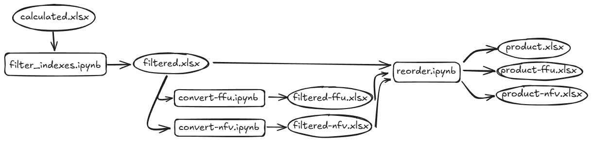

# Scripts flow

|  step  | script                                                                      | in filename                                           | out filename                                          | explanation                                |
| :----: | :-------------------------------------------------------------------------- | :---------------------------------------------------- | :---------------------------------------------------- | :----------------------------------------- |
|   -    | [test_data.ipynb](scripts/test_data.ipynb)                                  | -                                                     | -                                                     | Test some operations                       |
|   0    | xls_joiner.ipynb                                                            | SABI_Export_N.xlsx                                    | [joined.xlsx](data/original/joined.xlsx)              | Join XLSs in a single file                 |
|   1    | [db_reader.ipynb](scripts/db_reader.ipynb)                                  | [joined.xlsx](data/original/joined.xlsx)              | [formatted.xlsx](data/processed/formatted.xlsx)       | Reads original source and formats the data |
|   2    | [calc_columns.ipynb](scripts/calc_columns.ipynb)                            | [formatted.xlsx](data/processed/formatted.xlsx)       | [calculated.xlsx](data/processed/calculated.xlsx)     | Calcs all columns needed                   |
|   3    | [filter_indexes.ipynb](scripts/filter_indexes.ipynb)                        | [calculated.xlsx](data/processed/calculated.xlsx)     | [filtered.xlsx](data/processed/filtered.xlsx)         | Filters columns needed                     |
| 3 ffu  | [convert-ffu.ipynb](scripts/convert-ffu.ipynb)                              | [filtered.xlsx](data/processed/filtered.xlsx)         | [filtered-ffu.xlsx](data/processed/filtered-ffu.xlsx) | Apply ffu concept                          |
| 3 nfv  | [convert-nfv.ipynb](scripts/convert-nfv.ipynb)                              | [filtered.xlsx](data/processed/filtered.xlsx)         | [filtered-nfv.xlsx](data/processed/filtered-nfv.xlsx) | Apply nfv concept                          |
|   4    | [reorder_data.ipynb](scripts/reorder_data.ipynb)                            | [filtered.xlsx](data/processed/filtered.xlsx)         | [product.xlsx](data/product/product.xlsx)             | Reorder the data to feed the ia            |
| 4 ffu  | [reorder_data.ipynb](scripts/reorder_data.ipynb)                            | [filtered-ffu.xlsx](data/processed/filtered-ffu.xlsx) | [product-ffu.xlsx](data/product/product-ffu.xlsx)     | Reorder the data to feed the ffu ia        |
| 4 nfv  | [reorder_data.ipynb](scripts/reorder_data.ipynb)                            | [filtered-nfv.xlsx](data/processed/filtered-nfv.xlsx) | [product-nfv.xlsx](data/product/product-nfv.xlsx)     | Reorder the data to feed the nfv ia        |
|   ai   | [aicode.ipynb](aicode/aicode.ipynb)                                         | [product.xlsx](data/product/product.xlsx)             | -                                                     | The ia                                     |
| ai ffu | [filtered_familiar_unknowns.ipynb](aicode/filtered_familiar_unknowns.ipynb) | [product-ffu.xlsx](data/product/product-ffu.xlsx)     | -                                                     | The nfv ia                                 |
| ai nfv | [no_familiar_var.ipynb](aicode/no_familiar_var.ipynb)                       | [product-nfv.xlsx](data/product/product-nfv.xlsx)     | -                                                     | The nfv ia                                 |

> **ffu** (Filtered Familiar Unknowns): Filter rows with the `isFamiliar` value `unknown`.  
> **nfv** (No Familiar Var): Remove `isFamiliar` column from the data.

